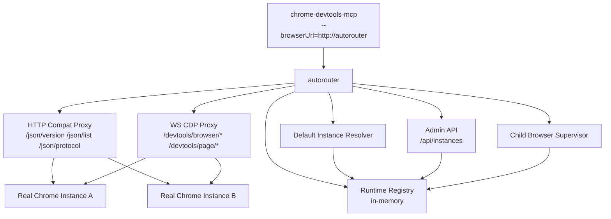
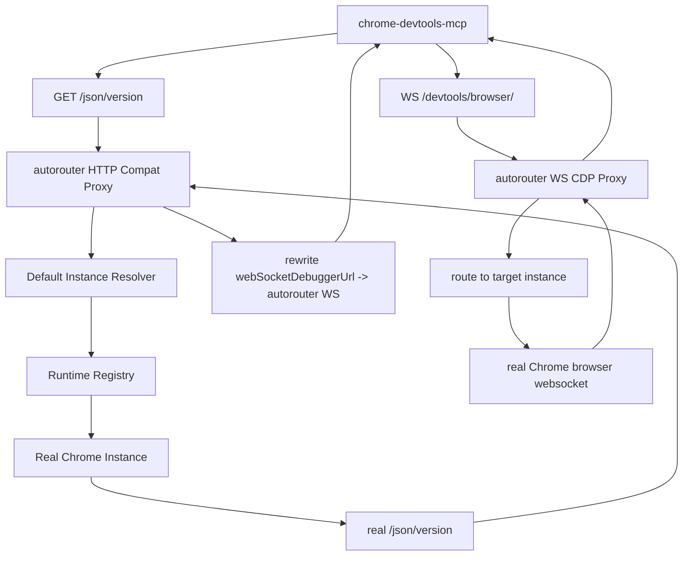
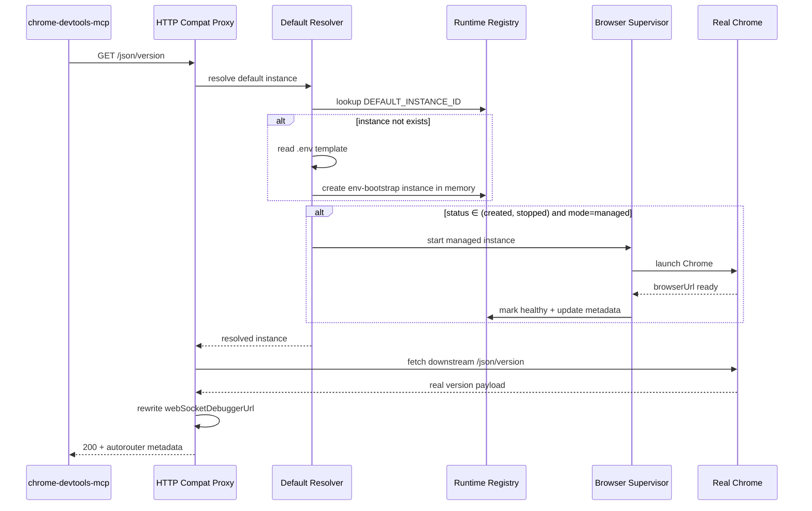
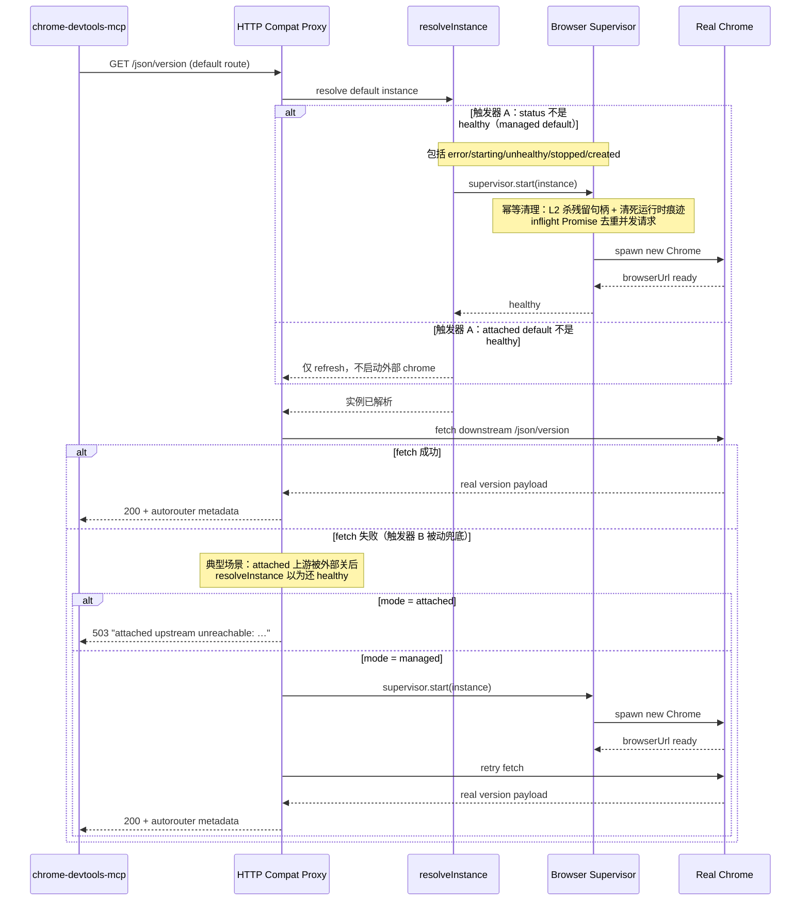

# cdp-autorouter 设计稿

## 1. 目标

`cdp-autorouter` 的目标不是替代 `chrome-devtools-mcp`，而是在它与真实 Chrome 实例之间增加一层可控的 `HTTP + WS` 代理与实例管理能力。

固定主链如下：

`chrome-devtools-mcp -> autorouter(HTTP+WS) -> real Chrome instance`

这层代理需要解决的问题：

- 对 `chrome-devtools-mcp` 保持单实例兼容
- 支持多实例显式路由
- 未指定实例时支持默认实例懒加载
- 对受管浏览器实例做统一生命周期管理
- 支持回收所有自己托管启动的子浏览器，包括进程退出时回收

## 2. 核心结论

本项目第一版采用以下硬规则：

- `chrome-devtools-mcp` 永远只连接 `autorouter`，不直接连接真实 Chrome
- `autorouter` 必须同时接管 HTTP 调试发现层和 WS/CDP 执行层
- `.env` 只负责策略与默认实例引导模板
- `Admin API` 管理运行期内存实例，不做落盘
- 未指定实例时，只认 `.env` 中的默认实例策略
- `managed` 实例必须登记并支持统一回收
- `attached` 实例允许接入，但不由本项目回收外部浏览器进程

## 3. 总体架构图



这张图表达的重点不是模块多少，而是职责边界：

- `HTTP Compat Proxy` 负责兼容 Chrome remote debugging HTTP 接口
- `WS CDP Proxy` 负责接住并转发所有 CDP WebSocket 连接
- `Default Instance Resolver` 负责未指定实例时的默认实例策略与懒加载
- `Runtime Registry` 负责内存中的实例定义与状态
- `Child Browser Supervisor` 负责托管浏览器的启动、停止与回收

## 4. 数据流转图



固定规则：

- `webSocketDebuggerUrl` 必须由 `autorouter` 改写并对外签发
- 真实 Chrome 的 WebSocket 地址只允许在 `autorouter` 内部使用
- 没有 WS 转发能力，这个项目的实例路由、懒加载、托管回收都会失效

## 5. 默认实例懒加载与路由层自愈时序图

默认路径上的自愈走**双触发器**：

- **触发器 A（主动，在 `resolveInstance` 中）**：请求到达时实例 status 已不是 healthy（例如 managed 子进程上一次退出后留下 `error/stopped/unhealthy`）。`error` `starting` `unhealthy` `stopped` `created` 全部交给 `supervisor.start()`，其内部 inflight Promise 去重保证并发请求只 spawn 一次。
- **触发器 B（被动兜底，在 compat handler 的 catch 中）**：`resolveInstance` 返回 healthy 但下游 fetch 仍失败（典型场景：attached 上游被外部关闭，autorouter 没有进程权限发现）。managed 走 retry-after-self-heal，attached 返 503 诊断。

两个触发器都仅作用于**默认实例 + 根路径**（`instanceId === undefined`）；显式路径不享受。

### 5.1 首次懒加载（默认实例不存在）



### 5.2 路由层自愈（仅根路径 + 默认实例）

描述两个触发器的中间状态与退出路径。主动触发（A）走上半分支，被动兜底（B）走下半分支。



### 5.3 路径范围语义

- 本节所有自愈语义仅适用于**默认实例与根路径兼容路由**
- 显式路径 `/instances/{id}/json/*` 不享受探死与自愈，表现与 v1 原设计一致（开发者手动 `POST /api/instances/{id}/restart`）
- 不偏业务路由，不偏 admin API；边界在代码上以 `instanceId === undefined` 判别

```

这两张时序对应的行为固定为：

- 服务启动时不预热默认实例
- 第一次命中根路径兼容接口时才触发默认实例解析
- 若默认实例不存在，则按 `.env` 模板注入内存
- 首次 `created` 状态走 §5.1 懒启动路径
- 运行期上游 chrome 不可达时走 §5.2：不同模式与检测点包括两个触发器
  - 触发器 A（主动）：managed default 崩溃后 exit handler 将 status 打为 `error` → 下次请求 resolveInstance 检测到不是 healthy → 交 supervisor.start 重拉
  - 触发器 B（被动兜底）：attached default 上游被外部关闭后 status 仍为 healthy——autorouter 没有进程权限发现——需 fetch 失败后才发现，在 catch 里返 503 诊断
  - managed 实例双触发器都能自愈；attached 实例只有触发器 B 返回 503，从不擅自启动外部 chrome
- 同一实例并发自愈通过 inflight Promise 去重，不会因突发流量 spawn 多个进程
- 启动超时由 `DEFAULT_INSTANCE_RESTART_TIMEOUT_MS` 控制，超时返回 503
- 显式实例路径 `/instances/{id}/json/*` 不享受任一触发器，开发者需手动 `POST /api/instances/{id}/restart`

## 6. 配置模型

### 6.0 请求分层与端口职责

同一个 `SERVER_PORT` 对外承担两种角色：

```
client ──► SERVER_PORT (autorouter 入口，默认 3100)
            ├─ 兼容模式 (default)：/json/* /devtools/*  ──► 下游 chrome 调试端口
            └─ 管理模式 (autorouter)：/api/instances/*   ──► RuntimeRegistry
```

- `SERVER_PORT`：autorouter **对外**端口，client 唯一感知的端口（默认 3100）。
- `DEFAULT_INSTANCE_BROWSER_URL` / `DEFAULT_INSTANCE_REMOTE_DEBUGGING_PORT`：autorouter **内部** fetch 的真实 chrome 端点。

端口隔离规则：

| 模式 | 下游端口来源 | 自指环风险 |
|------|-------------|:---------:|
| managed | `findAvailablePort()` 自动分配 | 无 |
| attached | 用户填写 `browserUrl` | 仅当误配为 `SERVER_PORT` 时触发 |

attached 模式下若 `browserUrl` 指向 autorouter 自身（如 `http://127.0.0.1:3100`），请求会自指循环，表现为 `fetch failed` / `unhealthy`。确保下游地址指向独立的 Chrome 进程即可。

客户端把 `SERVER_PORT` 当普通 CDP 端口使用即可，autorouter 在首次根路径请求到来时按 `.env` 模板懒加载默认实例，对客户端透明。

### 6.1 `.env` 负责什么

`.env` 第一版只负责策略和默认实例引导模板，不负责保存全部实例。

建议保留以下键：

```env
COMPAT_MODE_ENABLED=true
COMPAT_LAZY_LOAD_ENABLED=true
DEFAULT_INSTANCE_ID=default
DEFAULT_INSTANCE_MODE=managed
DEFAULT_INSTANCE_BROWSER_URL=
DEFAULT_INSTANCE_WS_ENDPOINT=
DEFAULT_INSTANCE_USER_DATA_DIR=
DEFAULT_INSTANCE_CHROME_ARGS=
DEFAULT_INSTANCE_HEADLESS=false
DEFAULT_INSTANCE_REMOTE_DEBUGGING_PORT=
```

> managed 模式下 `REMOTE_DEBUGGING_PORT` 和 `CHROME_ARGS` 留空即可，supervisor 会自动分配端口并注入 `--remote-debugging-port`。手动填写可固定下游端口，但不得等于 `SERVER_PORT`。

固定语义：

- `DEFAULT_INSTANCE_*` 只描述默认兼容实例的引导模板
- 如果同时给了 `DEFAULT_INSTANCE_BROWSER_URL` 和 `DEFAULT_INSTANCE_WS_ENDPOINT`，优先 `WS`
- 如果模板信息不足，根路径兼容模式直接报配置错误

### 6.2 内存实例负责什么

运行期实例由 `Admin API` 管理，只存在于内存中。

最小模型：

- `instanceId`
- `source`: `env-bootstrap` | `api-runtime`
- `mode`: `managed` | `attached`
- `status`: `created` | `starting` | `healthy` | `unhealthy` | `stopping` | `reclaiming` | `stopped` | `error`
  - 默认实例上 `error` 不是终态：意外退出会被记录为 `error` + `lastError` 以保留诊断信息，但下一次根路径请求（仅默认实例 + 根路径路由）会触发路由层自愈重启（参见 §9.2 触发器 A）
  - 实际上默认路径上 managed 实例的任何非 healthy 状态（含 `error/starting/unhealthy/stopped/created`）都会被触发器 A 纳入自愈
  - 显式实例路径上 `error` 仍为终态，需调 `POST /api/instances/{id}/restart` 手动恢复
- `browserUrl`
- `wsEndpoint`
- `version`
- `protocolVersion`
- `extensionsSummary`
- `lastHeartbeatAt`
- `lastError`
- `managedProcess`
- `userDataDir`
- `chromeLaunchArgs`

## 7. 接口设计

### 7.1 兼容调试接口

根路径接口只表示默认兼容实例：

- `GET /json/version`
- `GET /json/list`
- `GET /json`
- `GET /json/protocol`
- `WS /devtools/browser/<route-token>`
- `WS /devtools/page/<route-token>`

显式实例接口：

- `GET /instances/{instanceId}/json/version`
- `GET /instances/{instanceId}/json/list`
- `GET /instances/{instanceId}/json`
- `GET /instances/{instanceId}/json/protocol`
- `WS /instances/{instanceId}/devtools/browser/<route-token>`
- `WS /instances/{instanceId}/devtools/page/<route-token>`

### 7.2 Admin API

`Admin API` 从 `.env` 读策略，但实例本身只管内存。

接口：

- `POST /api/instances`
- `GET /api/instances`
- `GET /api/instances/{instanceId}`
- `PATCH /api/instances/{instanceId}`
- `DELETE /api/instances/{instanceId}`
- `POST /api/instances/{instanceId}/start`
- `POST /api/instances/{instanceId}/stop`
- `GET /api/instances/{instanceId}/health`
- `POST /api/instances/{instanceId}/refresh`
- `GET /api/instances/{instanceId}/extensions`
- `POST /api/instances/reclaim-managed`

`list instance` 与 `/json/list` 必须明确区分：

- `GET /api/instances`
  - 列的是 autorouter 管理的实例
- `GET /json/list`
  - 列的是某个真实 Chrome 实例下的 targets/pages

## 8. 路由规则

固定规则如下：

- 显式实例路径始终路由到指定 `instanceId`
- 根路径始终表示默认实例
- 根路径不做多实例聚合
- 根路径若命中默认实例，则行为尽量贴近单个 `chrome-devtools-mcp -> Chrome` 直连模式
- 所有 WS 请求都必须经过 `WS CDP Proxy`

## 8.1 WS 代理实现注意事项

`ws` 库（v8+）的 `message` 事件返回 `Buffer`，而 `send(Buffer)` 默认发送
**binary frame**（opcode 2）。Chrome DevTools Protocol 只接受 **text frame**
（opcode 1），收到 binary frame 后会直接 RST 连接（close code 1006，无 close
frame），客户端表现为 "CDP response channel closed"。

代理转发时必须保留原始 frame 类型：

```typescript
// ✗ 错误：Buffer 默认走 binary frame，Chrome 会断开
clientSocket.on('message', data => {
  downstreamSocket.send(data);
});

// ✓ 正确：通过 isBinary 保留 text/binary 语义
clientSocket.on('message', (data, isBinary) => {
  downstreamSocket.send(data, {binary: isBinary});
});
```

同理，`pendingMessages` 缓冲也需要记录 `binary` 标记，flush 时一并传递。

## 9. 生命周期与回收

### 9.1 实例启动

- `managed`
  - autorouter 启动浏览器，登记进程句柄与清理信息
- `attached`
  - autorouter 只接入已有浏览器，不创建外部进程

### 9.2 默认实例路由层自愈（Self-heal on Default Route）

**适用范围：仅限默认实例 + 根路径兼容路由**（`/json/version` `/json/list` `/json` `/json/protocol`）。显式实例路径 `/instances/{id}/json/*` 不享受自愈，失败返回 `500`——开发者已明确指定 id，应手动调用 `POST /api/instances/{id}/restart`。

#### 双触发器架构

| 触发器 | 检测点 | 触发条件 | 典型场景 |
|---------|--------|---------|----------|
| **A（主动）** | `resolveInstance` | managed default 的 status 不是 `healthy` | managed 子进程崩溃后 exit handler 将 status 打为 `error` |
| **B（被动兜底）** | compat handler 的 catch | resolveInstance 返回 healthy 但 fetch 下游失败 | attached 上游被外部关闭，autorouter 无进程权限发现 |

两个触发器互补：
- managed 实例大多数情况走触发器 A（exit handler 已经标记 error），触发器 B 仅作为“重启后立即又死”的二次兑底
- attached 实例只能被触发器 B 发现（无进程权限，无 exit handler），返回 503 不擅自启动

#### 触发器 A：resolveInstance 主动自愈

`resolveInstance` 在默认路径上检测到 managed default 的 status 不是 `healthy` 时，直接交给 `supervisor.start()`。包括以下所有状态：

- `error`：上一次意外退出
- `starting`：某个并发请求已在重拉中，本请求 await 同一 inflight Promise
- `unhealthy`：并发路径中 refresh 失败的中间状态
- `stopped`：被 admin API 停止后再次访问
- `created`：首次懒加载

这样做的好处：不管实例处于什么中间状态，默认路径的请求永远能拿到“端口可用”的结果（或超时 503），不会卡在中间状态上反复 refresh 失败。

#### 触发器 B：compat handler catch 被动兜底

```
GET /json/* (默认实例路径):
  resolveInstance 返回 healthy 的实例
  try fetch(downstream)
    ├─ 200 → 改写 webSocketDebuggerUrl 后返回
    └─ catch (上游不可达):
          ├─ mode === 'attached' → 503 "attached upstream unreachable: …"
          └─ mode === 'managed':
                ├─ supervisor.start(instance)   // 含 L2 进程残留兜底
                ├─ retry fetch (仅一次)
                └─ 200 / 或 503（重启超时）
```

#### L2 进程残留兜底（supervisor.start() 入口）

- 检查还未退出的旧 child 句柄 → `terminateProcess()` 后重新 spawn，防止旧 exit handler 污染新实例状态
- 清除过期运行时痕迹：managed 的 `browserUrl`/`managedProcess`/`managedProcessPid`/`extensionsSummary`/`pageCount`/`lastError`
- attached 的 `browserUrl` 是用户配置，不清；attached 不走 start()，无影响
- 只在注册表层面检查，不做 OS 级 PID 探活或全局 chrome.exe 扫描（后者属 D-3）

#### 并发去重

- supervisor 内部 `inflightStarts: Map<id, Promise<RuntimeInstance>>`，同实例 starting 期间返回同一 promise
- try/finally 保证完成后清除，无内存泄漏

#### 超时与响应码语义

- 启动超时由 `DEFAULT_INSTANCE_RESTART_TIMEOUT_MS` 控制（默认 8000 ms），超时返回 `503`，不是 `500`
- `error` 状态保留诊断信息（`lastError`）直到下次自愈成功，admin API 可查历史故障
- `500` 仅代表 autorouter 自身 bug（非上游不可达）

#### 与显式路径的边界

显式实例路径仍走原有 `resolveInstance` 逻辑：非 healthy 走 refresh，refresh 失败 throw 500。不跳过这个边界、不隐式帮开发者描实例。

### 9.3 统一回收

必须支持回收所有受管子浏览器。

回收范围：

- 所有 `managed` 实例
- 包括默认实例和运行期 API 创建实例

不回收：

- `attached` 实例背后的外部浏览器

回收触发：

- `POST /api/instances/{instanceId}/stop`
- `POST /api/instances/reclaim-managed`
- 进程退出
- 致命异常退出前的统一清理钩子

意外退出（非 reclaiming）只会标记 `error`，不删除注册表记录。后续恢复路径按是否默认实例分两路：

- 默认实例 + 根路径请求 → 下一次请求触发 §9.2 触发器 A 主动自愈（resolveInstance 检测到非 healthy 即交 supervisor.start）
- 显式实例路径请求 → 保持 500，开发者需手动 `POST /api/instances/{id}/restart`。

回收顺序：

1. 标记实例为 `reclaiming`
2. 拒绝新的 HTTP/WS 路由请求
3. 关闭现有代理连接
4. 尝试优雅关闭浏览器
5. 超时后强制 kill 子进程
6. 清理端口、进程句柄、临时目录和状态

## 10. 实现优先级

建议按下面顺序推进，而不是一开始把所有能力一起写完。

### P1. 最小骨架

- 建立 Node.js + TypeScript 项目骨架
- 引入 `.env` 解析
- 建立 `Runtime Registry`
- 建立最小 `Admin API`

### P2. 单实例兼容链路

- 完成默认实例解析
- 完成 `/json/version`
- 完成 `webSocketDebuggerUrl` 改写
- 完成最小 WS browser proxy

### P3. 多实例路由

- 加入实例前缀路径
- 支持显式实例 HTTP/WS 路由
- 完成 `GET /api/instances`

### P4. 托管与回收

- 加入 `managed` 启动能力
- 统一登记子进程
- 完成 stop / reclaim / exit cleanup

### P5. 元数据增强

- 健康检查
- 版本号
- 协议版本
- 扩展摘要
- `GET /api/instances/{instanceId}/extensions`

## 11. 推进建议

推进方式建议固定成“两文档一骨架”：

1. 先补 `README.md`
2. 再补 `docs/api-design.md`
3. 然后落最小项目骨架

最小骨架阶段只追求打通：

- `.env` 默认实例模板
- `GET /json/version`
- `WS /devtools/browser/*`
- `GET /api/instances`

只要这四条打通，整个项目主链就立住了，后面再叠加多实例、回收和扩展元数据会比较稳。
