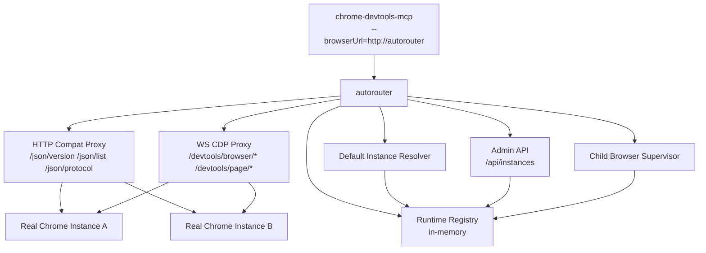
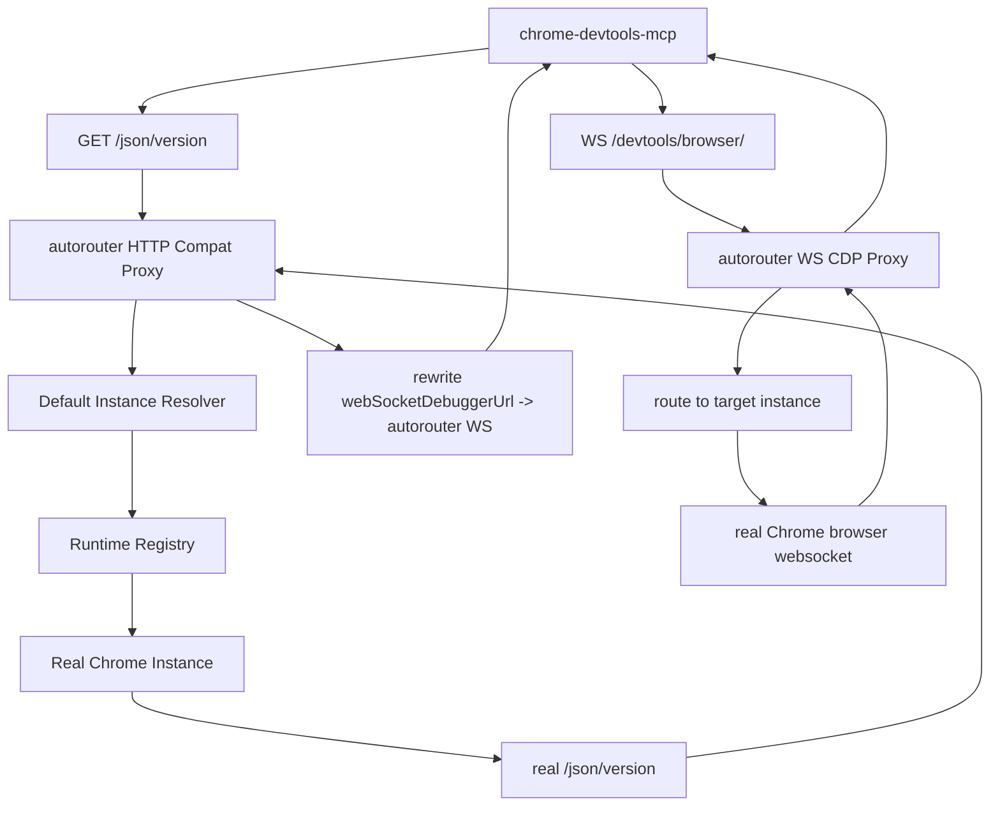
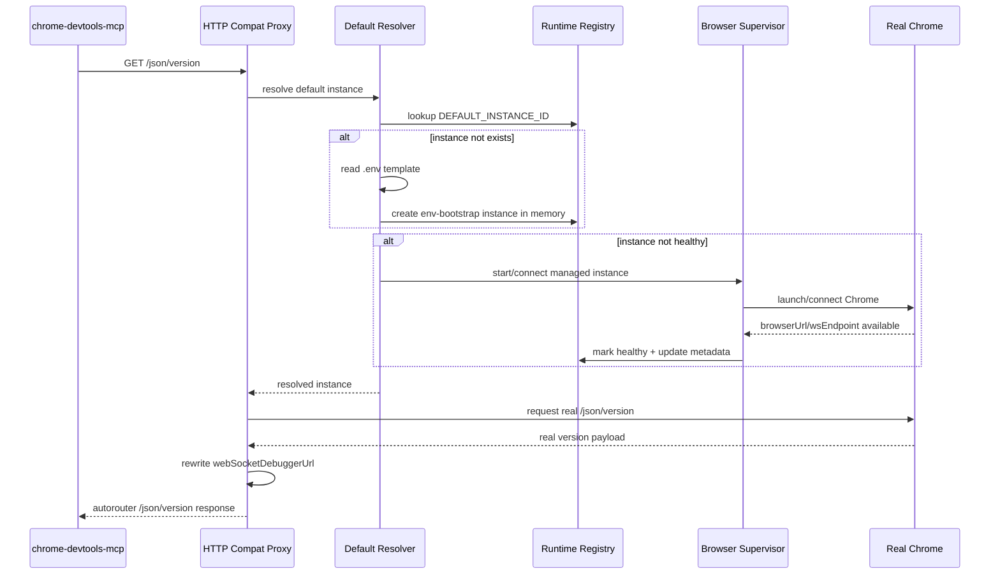

# cdp-autorouter 设计稿

## 1. 目标

`cdp-autorouter` 的目标不是替代 `chrome-devtools-mcp`，而是在它与真实 Chrome 实例之间增加一层可控的 `HTTP + WS` 代理与实例管理能力。

固定主链如下：

`chrome-devtools-mcp -> autorouter(HTTP+WS) -> real Chrome instance`

这层代理需要解决的问题：

- 对 `chrome-devtools-mcp` 保持单实例兼容
- 支持多实例显式路由
- 未指定实例时支持默认实例懒加载
- 对受管浏览器实例做统一生命周期管理
- 支持回收所有自己托管启动的子浏览器，包括进程退出时回收

## 2. 核心结论

本项目第一版采用以下硬规则：

- `chrome-devtools-mcp` 永远只连接 `autorouter`，不直接连接真实 Chrome
- `autorouter` 必须同时接管 HTTP 调试发现层和 WS/CDP 执行层
- `.env` 只负责策略与默认实例引导模板
- `Admin API` 管理运行期内存实例，不做落盘
- 未指定实例时，只认 `.env` 中的默认实例策略
- `managed` 实例必须登记并支持统一回收
- `attached` 实例允许接入，但不由本项目回收外部浏览器进程

## 3. 总体架构图



这张图表达的重点不是模块多少，而是职责边界：

- `HTTP Compat Proxy` 负责兼容 Chrome remote debugging HTTP 接口
- `WS CDP Proxy` 负责接住并转发所有 CDP WebSocket 连接
- `Default Instance Resolver` 负责未指定实例时的默认实例策略与懒加载
- `Runtime Registry` 负责内存中的实例定义与状态
- `Child Browser Supervisor` 负责托管浏览器的启动、停止与回收

## 4. 数据流转图



固定规则：

- `webSocketDebuggerUrl` 必须由 `autorouter` 改写并对外签发
- 真实 Chrome 的 WebSocket 地址只允许在 `autorouter` 内部使用
- 没有 WS 转发能力，这个项目的实例路由、懒加载、托管回收都会失效

## 5. 默认实例懒加载时序图



这个时序对应的行为固定为：

- 服务启动时不预热默认实例
- 第一次命中根路径兼容接口时才触发默认实例解析
- 若默认实例不存在，则按 `.env` 模板注入内存
- 若默认实例未启动，则立即懒启动

## 6. 配置模型

### 6.0 两端口模型

配置中最容易踩的坑是把 autorouter 入口端口和下游 chrome 端口混淆。固定语义如下：

```
client ──► SERVER_PORT (autorouter 入口) ──► 下游 chrome 调试端口
```

- `SERVER_PORT`：autorouter **对外**端口，client 唯一感知的端口（默认 9223）。
- `DEFAULT_INSTANCE_BROWSER_URL` / `DEFAULT_INSTANCE_REMOTE_DEBUGGING_PORT`：autorouter **内部** fetch 的真实 chrome 端点（managed 模式留空自动分配；attached 模式必填且 ≠ SERVER_PORT）。

两者必须不同。若 `browserUrl` 指向 autorouter 自身（即 `http://${SERVER_HOST}:${SERVER_PORT}`），autorouter 会把请求转发给自己造成自指环，外部表现为持续 `fetch failed` / `unhealthy`。配置加载阶段建议加防呆校验。

下游客户端不必感知 9223 是 autorouter——把它当成普通 CDP 端口即可，autorouter 在首次根路径请求到来时按 `.env` 模板懒加载默认实例，对客户端透明。

### 6.1 `.env` 负责什么

`.env` 第一版只负责策略和默认实例引导模板，不负责保存全部实例。

建议保留以下键：

```env
COMPAT_MODE_ENABLED=true
COMPAT_LAZY_LOAD_ENABLED=true
DEFAULT_INSTANCE_ID=default
DEFAULT_INSTANCE_MODE=managed
DEFAULT_INSTANCE_BROWSER_URL=
DEFAULT_INSTANCE_WS_ENDPOINT=
DEFAULT_INSTANCE_USER_DATA_DIR=.tmp/default-profile
DEFAULT_INSTANCE_CHROME_ARGS=--remote-debugging-port=9222
DEFAULT_INSTANCE_HEADLESS=false
DEFAULT_INSTANCE_REMOTE_DEBUGGING_PORT=9222
```

固定语义：

- `DEFAULT_INSTANCE_*` 只描述默认兼容实例的引导模板
- 如果同时给了 `DEFAULT_INSTANCE_BROWSER_URL` 和 `DEFAULT_INSTANCE_WS_ENDPOINT`，优先 `WS`
- 如果模板信息不足，根路径兼容模式直接报配置错误

### 6.2 内存实例负责什么

运行期实例由 `Admin API` 管理，只存在于内存中。

最小模型：

- `instanceId`
- `source`: `env-bootstrap` | `api-runtime`
- `mode`: `managed` | `attached`
- `status`: `created` | `starting` | `healthy` | `unhealthy` | `stopping` | `reclaiming` | `stopped` | `error`
- `browserUrl`
- `wsEndpoint`
- `version`
- `protocolVersion`
- `extensionsSummary`
- `lastHeartbeatAt`
- `lastError`
- `managedProcess`
- `userDataDir`
- `chromeLaunchArgs`

## 7. 接口设计

### 7.1 兼容调试接口

根路径接口只表示默认兼容实例：

- `GET /json/version`
- `GET /json/list`
- `GET /json`
- `GET /json/protocol`
- `WS /devtools/browser/<route-token>`
- `WS /devtools/page/<route-token>`

显式实例接口：

- `GET /instances/{instanceId}/json/version`
- `GET /instances/{instanceId}/json/list`
- `GET /instances/{instanceId}/json`
- `GET /instances/{instanceId}/json/protocol`
- `WS /instances/{instanceId}/devtools/browser/<route-token>`
- `WS /instances/{instanceId}/devtools/page/<route-token>`

### 7.2 Admin API

`Admin API` 从 `.env` 读策略，但实例本身只管内存。

接口：

- `POST /api/instances`
- `GET /api/instances`
- `GET /api/instances/{instanceId}`
- `PATCH /api/instances/{instanceId}`
- `DELETE /api/instances/{instanceId}`
- `POST /api/instances/{instanceId}/start`
- `POST /api/instances/{instanceId}/stop`
- `GET /api/instances/{instanceId}/health`
- `POST /api/instances/{instanceId}/refresh`
- `GET /api/instances/{instanceId}/extensions`
- `POST /api/instances/reclaim-managed`

`list instance` 与 `/json/list` 必须明确区分：

- `GET /api/instances`
  - 列的是 autorouter 管理的实例
- `GET /json/list`
  - 列的是某个真实 Chrome 实例下的 targets/pages

## 8. 路由规则

固定规则如下：

- 显式实例路径始终路由到指定 `instanceId`
- 根路径始终表示默认实例
- 根路径不做多实例聚合
- 根路径若命中默认实例，则行为尽量贴近单个 `chrome-devtools-mcp -> Chrome` 直连模式
- 所有 WS 请求都必须经过 `WS CDP Proxy`

## 8.1 WS 代理实现注意事项

`ws` 库（v8+）的 `message` 事件返回 `Buffer`，而 `send(Buffer)` 默认发送
**binary frame**（opcode 2）。Chrome DevTools Protocol 只接受 **text frame**
（opcode 1），收到 binary frame 后会直接 RST 连接（close code 1006，无 close
frame），客户端表现为 "CDP response channel closed"。

代理转发时必须保留原始 frame 类型：

```typescript
// ✗ 错误：Buffer 默认走 binary frame，Chrome 会断开
clientSocket.on('message', data => {
  downstreamSocket.send(data);
});

// ✓ 正确：通过 isBinary 保留 text/binary 语义
clientSocket.on('message', (data, isBinary) => {
  downstreamSocket.send(data, {binary: isBinary});
});
```

同理，`pendingMessages` 缓冲也需要记录 `binary` 标记，flush 时一并传递。

## 9. 生命周期与回收

### 9.1 实例启动

- `managed`
  - autorouter 启动浏览器，登记进程句柄与清理信息
- `attached`
  - autorouter 只接入已有浏览器，不创建外部进程

### 9.2 统一回收

必须支持回收所有受管子浏览器。

回收范围：

- 所有 `managed` 实例
- 包括默认实例和运行期 API 创建实例

不回收：

- `attached` 实例背后的外部浏览器

回收触发：

- `POST /api/instances/{instanceId}/stop`
- `POST /api/instances/reclaim-managed`
- 进程退出
- 致命异常退出前的统一清理钩子

回收顺序：

1. 标记实例为 `reclaiming`
2. 拒绝新的 HTTP/WS 路由请求
3. 关闭现有代理连接
4. 尝试优雅关闭浏览器
5. 超时后强制 kill 子进程
6. 清理端口、进程句柄、临时目录和状态

## 10. 实现优先级

建议按下面顺序推进，而不是一开始把所有能力一起写完。

### P1. 最小骨架

- 建立 Node.js + TypeScript 项目骨架
- 引入 `.env` 解析
- 建立 `Runtime Registry`
- 建立最小 `Admin API`

### P2. 单实例兼容链路

- 完成默认实例解析
- 完成 `/json/version`
- 完成 `webSocketDebuggerUrl` 改写
- 完成最小 WS browser proxy

### P3. 多实例路由

- 加入实例前缀路径
- 支持显式实例 HTTP/WS 路由
- 完成 `GET /api/instances`

### P4. 托管与回收

- 加入 `managed` 启动能力
- 统一登记子进程
- 完成 stop / reclaim / exit cleanup

### P5. 元数据增强

- 健康检查
- 版本号
- 协议版本
- 扩展摘要
- `GET /api/instances/{instanceId}/extensions`

## 11. 推进建议

推进方式建议固定成“两文档一骨架”：

1. 先补 `README.md`
2. 再补 `docs/api-design.md`
3. 然后落最小项目骨架

最小骨架阶段只追求打通：

- `.env` 默认实例模板
- `GET /json/version`
- `WS /devtools/browser/*`
- `GET /api/instances`

只要这四条打通，整个项目主链就立住了，后面再叠加多实例、回收和扩展元数据会比较稳。
