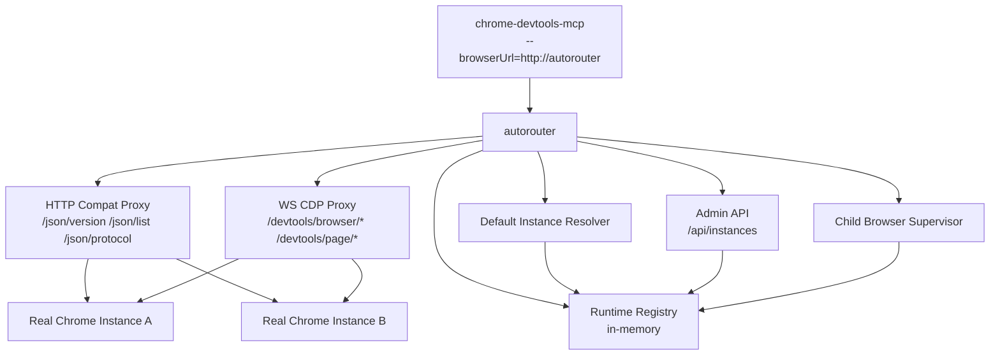
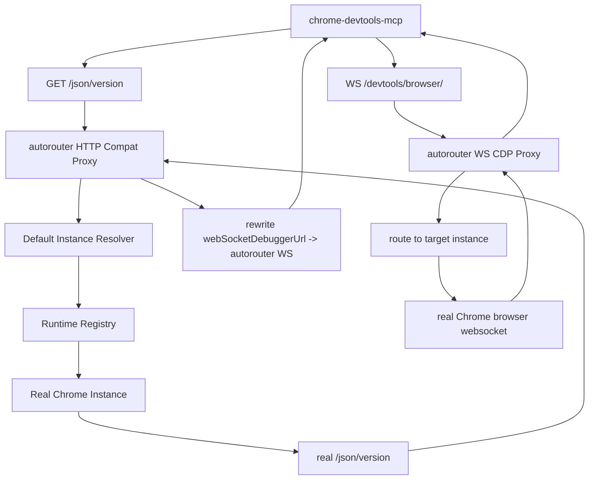
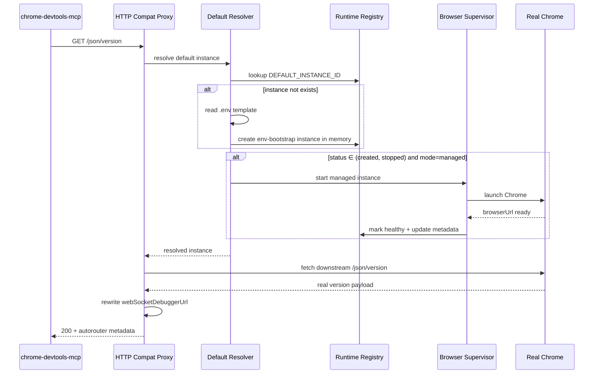
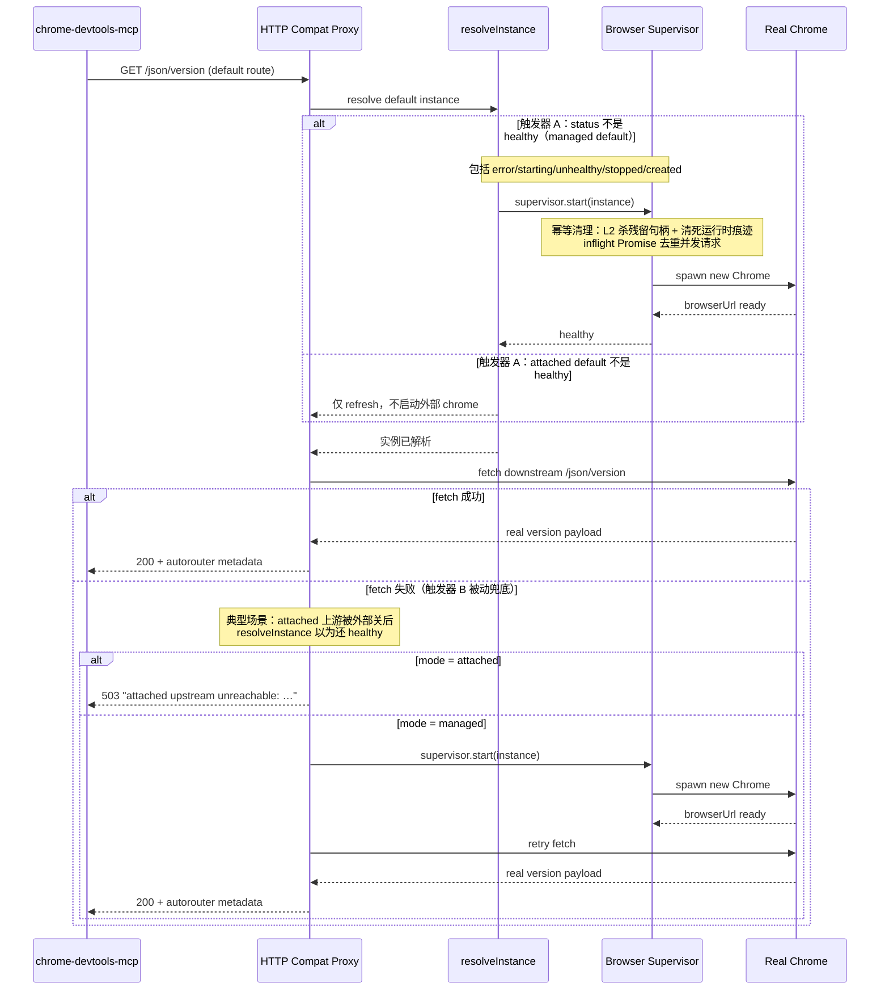

# cdp-autorouter 设计稿

## 1. 目标

`cdp-autorouter` 的目标不是替代 `chrome-devtools-mcp`，而是在它与真实 Chrome 实例之间增加一层可控的 `HTTP + WS` 代理与实例管理能力。

固定主链如下：

`chrome-devtools-mcp -> autorouter(HTTP+WS) -> real Chrome instance`

这层代理需要解决的问题：

- 对 `chrome-devtools-mcp` 保持单实例兼容
- 支持多实例显式路由
- 未指定实例时支持默认实例懒加载
- 对受管浏览器实例做统一生命周期管理
- 支持回收所有自己托管启动的子浏览器，包括进程退出时回收

## 2. 核心结论

本项目第一版采用以下硬规则：

- `chrome-devtools-mcp` 永远只连接 `autorouter`，不直接连接真实 Chrome
- `autorouter` 必须同时接管 HTTP 调试发现层和 WS/CDP 执行层
- `.env` 只负责策略与默认实例引导模板
- `Admin API` 管理运行期内存实例，不做落盘
- 未指定实例时，只认 `.env` 中的默认实例策略
- `managed` 实例必须登记并支持统一回收
- `attached` 实例允许接入，但不由本项目回收外部浏览器进程

## 3. 总体架构图


```mermaid
flowchart TD
    A["chrome-devtools-mcp<br/>--browserUrl=http://autorouter"] --> B["autorouter"]
    B --> C["HTTP Compat Proxy<br/>/json/version /json/list /json/protocol"]
    B --> D["WS CDP Proxy<br/>/devtools/browser/* /devtools/page/*"]
    B --> E["Admin API<br/>/api/instances"]
    B --> F["Default Instance Resolver"]
    B --> G["Runtime Registry<br/>in-memory"]
    B --> H["Child Browser Supervisor"]
    F --> G
    E --> G
    H --> G
    C --> I["Real Chrome Instance A"]
    D --> I
    C --> J["Real Chrome Instance B"]
    D --> J
```

这张图表达的重点不是模块多少，而是职责边界：

- `HTTP Compat Proxy` 负责兼容 Chrome remote debugging HTTP 接口
- `WS CDP Proxy` 负责接住并转发所有 CDP WebSocket 连接
- `Default Instance Resolver` 负责未指定实例时的默认实例策略与懒加载
- `Runtime Registry` 负责内存中的实例定义与状态
- `Child Browser Supervisor` 负责托管浏览器的启动、停止与回收

## 4. 数据流转图


```mermaid
flowchart TD
    A["chrome-devtools-mcp"] --> B["GET /json/version"]
    B --> C["autorouter HTTP Compat Proxy"]
    C --> D["Default Instance Resolver"]
    D --> E["Runtime Registry"]
    E --> F["Real Chrome Instance"]
    F --> G["real /json/version"]
    G --> C
    C --> H["rewrite webSocketDebuggerUrl -> autorouter WS"]
    H --> A
    A --> I["WS /devtools/browser/<token>"]
    I --> J["autorouter WS CDP Proxy"]
    J --> K["route to target instance"]
    K --> L["real Chrome browser websocket"]
    L --> J
    J --> A
```

固定规则：

- `webSocketDebuggerUrl` 必须由 `autorouter` 改写并对外签发
- 真实 Chrome 的 WebSocket 地址只允许在 `autorouter` 内部使用
- 没有 WS 转发能力，这个项目的实例路由、懒加载、托管回收都会失效

## 5. 默认实例懒加载与路由层自愈时序图

默认路径上的自愈走**双触发器**：

- **触发器 A（主动，在 `resolveInstance` 中）**：请求到达时实例 status 已不是 healthy（例如 managed 子进程上一次退出后留下 `error/stopped/unhealthy`）。`error` `starting` `unhealthy` `stopped` `created` 全部交给 `supervisor.start()`，其内部 inflight Promise 去重保证并发请求只 spawn 一次。
- **触发器 B（被动兜底，在 compat handler 的 catch 中）**：`resolveInstance` 返回 healthy 但下游 fetch 仍失败（典型场景：attached 上游被外部关闭，autorouter 没有进程权限发现）。managed 走 retry-after-self-heal，attached 返 503 诊断。

两个触发器作用于**所有 managed 实例的请求路径**（根路径 + 显式实例路径，2026-09-20 起由"仅默认实例"推广）；attached 实例在任何路径上都不被自动拉起，仅由触发器 B 返回 503 诊断。懒加载语义（§5.1 实例不存在时按 `.env` 模板注入内存）仍只属于默认实例。

### 5.1 首次懒加载（默认实例不存在）


```mermaid
sequenceDiagram
    participant M as chrome-devtools-mcp
    participant H as HTTP Compat Proxy
    participant R as Default Resolver
    participant G as Runtime Registry
    participant S as Browser Supervisor
    participant C as Real Chrome

    M->>H: GET /json/version
    H->>R: resolve default instance
    R->>G: lookup DEFAULT_INSTANCE_ID
    alt instance not exists
        R->>R: read .env template
        R->>G: create env-bootstrap instance in memory
    end
    alt status ∈ (created, stopped) and mode=managed
        R->>S: start managed instance
        S->>C: launch Chrome
        C-->>S: browserUrl ready
        S->>G: mark healthy + update metadata
    end
    R-->>H: resolved instance
    H->>C: fetch downstream /json/version
    C-->>H: real version payload
    H->>H: rewrite webSocketDebuggerUrl
    H-->>M: 200 + autorouter metadata
```

### 5.2 路由层自愈（根路径 + 显式实例路径的 managed 实例）

描述两个触发器的中间状态与退出路径。主动触发（A）走上半分支，被动兜底（B）走下半分支。


```mermaid
sequenceDiagram
    participant M as chrome-devtools-mcp
    participant H as HTTP Compat Proxy
    participant R as resolveInstance
    participant S as Browser Supervisor
    participant C as Real Chrome

    M->>H: GET /json/version (default route)
    H->>R: resolve default instance
    alt 触发器 A：status 不是 healthy（managed default）
        Note over R,S: 包括 error/starting/unhealthy/stopped/created
        R->>S: supervisor.start(instance)
        Note over S: 幂等清理：L2 杀残留句柄 + 清死运行时痕迹<br/>inflight Promise 去重并发请求
        S->>C: spawn new Chrome
        C-->>S: browserUrl ready
        S-->>R: healthy
    else 触发器 A：attached default 不是 healthy
        R-->>H: 仅 refresh，不启动外部 chrome
    end
    R-->>H: 实例已解析
    H->>C: fetch downstream /json/version
    alt fetch 成功
        C-->>H: real version payload
        H-->>M: 200 + autorouter metadata
    else fetch 失败（触发器 B 被动兜底）
        Note over H: 典型场景：attached 上游被外部关后<br/>resolveInstance 以为还 healthy
        alt mode = attached
            H-->>M: 503 "attached upstream unreachable: …"
        else mode = managed
            H->>S: supervisor.start(instance)
            S->>C: spawn new Chrome
            C-->>S: browserUrl ready
            H->>C: retry fetch
            C-->>H: real version payload
            H-->>M: 200 + autorouter metadata
        end
    end
```

### 5.3 路径范围语义

- 自愈语义适用于**所有 managed 实例的请求路径**（根路径 + 显式实例路径 `/instances/{id}/json/*`，2026-09-20 起）
- attached 实例在两条路径上都不自愈：上游不可达统一返 503 诊断，不擅自启动外部浏览器
- 不偏业务路由，不偏 admin API；懒加载（实例不存在时按模板注入）仍以 `instanceId === undefined` 判别，只属于默认实例

```

这两张时序对应的行为固定为：

- 服务启动时不预热默认实例
- 第一次命中根路径兼容接口时才触发默认实例解析
- 若默认实例不存在，则按 `.env` 模板注入内存
- 首次 `created` 状态走 §5.1 懒启动路径
- 运行期上游 chrome 不可达时走 §5.2：不同模式与检测点包括两个触发器
  - 触发器 A（主动）：managed 实例崩溃后 exit handler 将 status 打为 `error` → 下次请求 resolveInstance 检测到不是 healthy → 交 supervisor.start 重拉
  - 触发器 B（被动兜底）：attached 上游被外部关闭后 status 仍为 healthy——autorouter 没有进程权限发现——需 fetch 失败后才发现，在 catch 里返 503 诊断
  - managed 实例双触发器都能自愈；attached 实例只有触发器 B 返回 503，从不擅自启动外部 chrome
- 同一实例并发自愈通过 inflight Promise 去重，不会因突发流量 spawn 多个进程
- 启动超时由 `DEFAULT_INSTANCE_RESTART_TIMEOUT_MS` 控制，超时返回 503
- 显式实例路径同样享受两个触发器（2026-09-20 起）；`POST /api/instances/{id}/restart` 仍是可用的手动恢复手段，但不再是唯一途径

## 6. 配置模型

### 6.0 请求分层与端口职责

同一个 `SERVER_PORT` 对外承担两种角色：

```
client ──► SERVER_PORT (autorouter 入口，默认 3100)
            ├─ 兼容模式 (default)：/json/* /devtools/*  ──► 下游 chrome 调试端口
            └─ 管理模式 (autorouter)：/api/instances/*   ──► RuntimeRegistry
```

- `SERVER_PORT`：autorouter **对外**端口，client 唯一感知的端口（默认 3100）。
- `DEFAULT_INSTANCE_BROWSER_URL` / `DEFAULT_INSTANCE_REMOTE_DEBUGGING_PORT`：autorouter **内部** fetch 的真实 chrome 端点。

端口隔离规则：

| 模式 | 下游端口来源 | 自指环风险 |
|------|-------------|:---------:|
| managed | `findAvailablePort()` 自动分配 | 无 |
| attached | 用户填写 `browserUrl` | 仅当误配为 `SERVER_PORT` 时触发 |

attached 模式下若 `browserUrl` 指向 autorouter 自身（如 `http://127.0.0.1:3100`），请求会自指循环，表现为 `fetch failed` / `unhealthy`。确保下游地址指向独立的 Chrome 进程即可。

客户端把 `SERVER_PORT` 当普通 CDP 端口使用即可，autorouter 在首次根路径请求到来时按 `.env` 模板懒加载默认实例，对客户端透明。

### 6.1 `.env` 负责什么

`.env` 第一版只负责策略和默认实例引导模板，不负责保存全部实例。

建议保留以下键：

```env
COMPAT_MODE_ENABLED=true
COMPAT_LAZY_LOAD_ENABLED=true
DEFAULT_INSTANCE_ID=default
DEFAULT_INSTANCE_MODE=managed
DEFAULT_INSTANCE_BROWSER_URL=
DEFAULT_INSTANCE_WS_ENDPOINT=
DEFAULT_INSTANCE_USER_DATA_DIR=
DEFAULT_INSTANCE_CHROME_ARGS=
DEFAULT_INSTANCE_HEADLESS=false
DEFAULT_INSTANCE_REMOTE_DEBUGGING_PORT=
```

> managed 模式下 `REMOTE_DEBUGGING_PORT` 和 `CHROME_ARGS` 留空即可，supervisor 会自动分配端口并注入 `--remote-debugging-port`。手动填写可固定下游端口，但不得等于 `SERVER_PORT`。

固定语义：

- `DEFAULT_INSTANCE_*` 只描述默认兼容实例的引导模板
- 如果同时给了 `DEFAULT_INSTANCE_BROWSER_URL` 和 `DEFAULT_INSTANCE_WS_ENDPOINT`，优先 `WS`
- 如果模板信息不足，根路径兼容模式直接报配置错误

### 6.2 内存实例负责什么

运行期实例由 `Admin API` 管理，只存在于内存中。

最小模型：

- `instanceId`
- `source`: `env-bootstrap` | `api-runtime`
- `mode`: `managed` | `attached`
- `status`: `created` | `starting` | `healthy` | `unhealthy` | `stopping` | `reclaiming` | `stopped` | `error`
  - managed 实例上 `error` 不是终态：意外退出会被记录为 `error` + `lastError` 以保留诊断信息，下一次请求（根路径或显式实例路径）会触发路由层自愈重启（参见 §9.2 触发器 A）；server 端低频巡检（§9.4）也会在无请求时自动恢复
  - managed 实例的任何非 healthy 状态（含 `error/starting/unhealthy/stopped/created`）都会被触发器 A 纳入自愈
  - attached 实例的 `error/unhealthy` 仍为终态：只在请求时返 503 诊断，永不自动拉起
- `browserUrl`
- `wsEndpoint`
- `version`
- `protocolVersion`
- `extensionsSummary`
- `lastHeartbeatAt`
- `lastError`
- `managedProcess`
- `userDataDir`
- `chromeLaunchArgs`

## 7. 接口设计

### 7.1 兼容调试接口

根路径接口只表示默认兼容实例：

- `GET /json/version`
- `GET /json/list`
- `GET /json`
- `GET /json/protocol`
- `WS /devtools/browser/<route-token>`
- `WS /devtools/page/<route-token>`

显式实例接口：

- `GET /instances/{instanceId}/json/version`
- `GET /instances/{instanceId}/json/list`
- `GET /instances/{instanceId}/json`
- `GET /instances/{instanceId}/json/protocol`
- `WS /instances/{instanceId}/devtools/browser/<route-token>`
- `WS /instances/{instanceId}/devtools/page/<route-token>`

### 7.2 Admin API

`Admin API` 从 `.env` 读策略，但实例本身只管内存。

接口：

- `POST /api/instances`
- `GET /api/instances`
- `GET /api/instances/{instanceId}`
- `PATCH /api/instances/{instanceId}`
- `DELETE /api/instances/{instanceId}`
- `POST /api/instances/{instanceId}/start`
- `POST /api/instances/{instanceId}/stop`
- `GET /api/instances/{instanceId}/health`
- `POST /api/instances/{instanceId}/refresh`
- `GET /api/instances/{instanceId}/extensions`
- `POST /api/instances/reclaim-managed`

`list instance` 与 `/json/list` 必须明确区分：

- `GET /api/instances`
  - 列的是 autorouter 管理的实例
- `GET /json/list`
  - 列的是某个真实 Chrome 实例下的 targets/pages

## 8. 路由规则

固定规则如下：

- 显式实例路径始终路由到指定 `instanceId`
- 根路径始终表示默认实例
- 根路径不做多实例聚合
- 根路径若命中默认实例，则行为尽量贴近单个 `chrome-devtools-mcp -> Chrome` 直连模式
- 所有 WS 请求都必须经过 `WS CDP Proxy`

## 8.1 WS 代理实现注意事项

`ws` 库（v8+）的 `message` 事件返回 `Buffer`，而 `send(Buffer)` 默认发送
**binary frame**（opcode 2）。Chrome DevTools Protocol 只接受 **text frame**
（opcode 1），收到 binary frame 后会直接 RST 连接（close code 1006，无 close
frame），客户端表现为 "CDP response channel closed"。

代理转发时必须保留原始 frame 类型：

```typescript
// ✗ 错误：Buffer 默认走 binary frame，Chrome 会断开
clientSocket.on('message', data => {
  downstreamSocket.send(data);
});

// ✓ 正确：通过 isBinary 保留 text/binary 语义
clientSocket.on('message', (data, isBinary) => {
  downstreamSocket.send(data, {binary: isBinary});
});
```

同理，`pendingMessages` 缓冲也需要记录 `binary` 标记，flush 时一并传递。

## 9. 生命周期与回收

### 9.1 实例启动

- `managed`
  - autorouter 启动浏览器，登记进程句柄与清理信息
- `attached`
  - autorouter 只接入已有浏览器，不创建外部进程

### 9.2 路由层自愈（Self-heal on Request Route）

**适用范围：所有 managed 实例的请求路径**——根路径（`/json/version` `/json/list` `/json` `/json/protocol`）与显式实例路径（`/instances/{id}/json/*`），2026-09-20 起由"仅默认实例"推广（动机：用户关闭浏览器后，远端 CLI 下一场景的首次请求必须当场恢复，不能等巡检或人工 restart）。attached 实例在任何路径上都不自愈，上游不可达返 `503` 诊断。

#### 双触发器架构

| 触发器 | 检测点 | 触发条件 | 典型场景 |
|---------|--------|---------|----------|
| **A（主动）** | `resolveInstance` | managed 实例的 status 不是 `healthy` | managed 子进程崩溃后 exit handler 将 status 打为 `error` |
| **B（被动兜底）** | compat handler 的 catch | resolveInstance 返回 healthy 但 fetch 下游失败 | attached 上游被外部关闭，autorouter 无进程权限发现 |

两个触发器互补：
- managed 实例大多数情况走触发器 A（exit handler 已经标记 error），触发器 B 仅作为“重启后立即又死”的二次兑底
- attached 实例只能被触发器 B 发现（无进程权限，无 exit handler），返回 503 不擅自启动

#### 触发器 A：resolveInstance 主动自愈

`resolveInstance` 在请求路径上检测到 managed 实例的 status 不是 `healthy` 时，直接交给 `supervisor.start()`。包括以下所有状态：

- `error`：上一次意外退出
- `starting`：某个并发请求已在重拉中，本请求 await 同一 inflight Promise
- `unhealthy`：并发路径中 refresh 失败的中间状态
- `stopped`：被 admin API 停止后再次访问
- `created`：首次懒加载

这样做的好处：不管实例处于什么中间状态，请求永远能拿到“端口可用”的结果（或超时 503），不会卡在中间状态上反复 refresh 失败。

#### 触发器 B：compat handler catch 被动兜底

```
GET /json/* (默认实例路径):
  resolveInstance 返回 healthy 的实例
  try fetch(downstream)
    ├─ 200 → 改写 webSocketDebuggerUrl 后返回
    └─ catch (上游不可达):
          ├─ mode === 'attached' → 503 "attached upstream unreachable: …"
          └─ mode === 'managed':
                ├─ supervisor.start(instance)   // 含 L2 进程残留兜底
                ├─ retry fetch (仅一次)
                └─ 200 / 或 503（重启超时）
```

#### L2 进程残留兜底（supervisor.start() 入口）

- 检查还未退出的旧 child 句柄 → `terminateProcess()` 后重新 spawn，防止旧 exit handler 污染新实例状态
- 清除过期运行时痕迹：managed 的 `browserUrl`/`managedProcess`/`managedProcessPid`/`extensionsSummary`/`pageCount`/`lastError`
- attached 的 `browserUrl` 是用户配置，不清；attached 不走 start()，无影响
- 只在注册表层面检查，不做 OS 级 PID 探活或全局 chrome.exe 扫描（后者属 D-3）

#### 并发去重

- supervisor 内部 `inflightStarts: Map<id, Promise<RuntimeInstance>>`，同实例 starting 期间返回同一 promise
- try/finally 保证完成后清除，无内存泄漏

#### 超时与响应码语义

- 启动超时由 `DEFAULT_INSTANCE_RESTART_TIMEOUT_MS` 控制（默认 8000 ms），超时返回 `503`，不是 `500`
- `error` 状态保留诊断信息（`lastError`）直到下次自愈成功，admin API 可查历史故障
- `500` 仅代表 autorouter 自身 bug（非上游不可达）

#### 与显式路径的边界

2026-09-20 起显式实例路径与根路径共享同一套双触发器自愈，不再设"显式路径返 500 等人工 restart"的边界。保留的边界只剩模式维度：attached 永不自动拉起（503 诊断），managed 才允许 supervisor.start 重拉。

### 9.3 统一回收

必须支持回收所有受管子浏览器。

回收范围：

- 所有 `managed` 实例
- 包括默认实例和运行期 API 创建实例

不回收：

- `attached` 实例背后的外部浏览器

回收触发：

- `POST /api/instances/{instanceId}/stop`
- `POST /api/instances/reclaim-managed`
- 进程退出
- 致命异常退出前的统一清理钩子

意外退出（非 reclaiming）只会标记 `error`，不删除注册表记录。后续恢复路径有三条（按响应速度排序）：

- 任意请求路径（根/显式）→ 下一次请求触发 §9.2 触发器 A 主动自愈（resolveInstance 检测到非 healthy 即交 supervisor.start）
- server 端低频巡检（§9.4）→ 无请求时也自动恢复，周期 ≤ `HEALTH_CHECK_INTERVAL_MS`
- 手动 `POST /api/instances/{id}/restart` → 仍可用，但已非必需

回收顺序：

1. 标记实例为 `reclaiming`
2. 拒绝新的 HTTP/WS 路由请求
3. 关闭现有代理连接
4. 尝试优雅关闭浏览器
5. 超时后强制 kill 子进程
6. 清理端口、进程句柄、临时目录和状态

### 9.4 server 端低频健康巡检（HealthMonitor）

2026-09-20 新增（案例见 `docs/notes/case/2026-09-20-managed-exit-and-ssh-flap.md`）。请求路径自愈（§9.2）只在"有请求时"生效；巡检把"发现 + 恢复"闭环补到"无请求时"，并替代请求时懒标记的主动健康探测。

行为契约：

- 每个周期（`HEALTH_CHECK_INTERVAL_MS`，默认 30s）对所有实例主动 `refresh()`：`healthy` 的维持心跳，探测失败的落 `unhealthy`
- `error`/`unhealthy` 的 **managed** 实例自动 `supervisor.start()` 恢复；`created`/`stopped` 不拉起（不替用户做启动决定）；`starting`/`reclaiming` 跳过
- **attached 只探测，永不拉起/杀外部浏览器**——回收边界与请求路径一致
- 防护：同一实例两次恢复尝试间隔 ≥ `HEALTH_HEAL_COOLDOWN_MS`（默认 60s）；连续失败 ≥ `HEALTH_HEAL_MAX_FAILURES`（默认 5 次）后熔断，等人工或状态变化；tick 防重入
- 与请求路径自愈的竞态由 supervisor inflight Promise 去重吸收（同实例并发 start 只 spawn 一次）
- 总开关 `HEALTH_MONITOR_ENABLED`（默认 true）；shutdown 时先于实例回收停止，避免巡检与回收竞争
- 审计：`instance:heal-attempt` / `instance:heal-success` / `instance:heal-failed` 写入操作日志，可与 `instance:spawn`/`instance:exit` 对账
- **巡检不替代请求侧探测**：`GET /api/instances`（响应前实时 refresh）、`POST /api/instances/{id}/refresh`、`GET /api/instances/{id}/health`（实时探测，无副作用不拉起）、`/json/*` 下游 fetch、WS 拨号，都是慢心跳窗口内"立刻定位活没活"的按需探针；`GET /api/instances/{id}/status` 保持纯缓存语义（看板轮询零开销）

## 10. 实现优先级

建议按下面顺序推进，而不是一开始把所有能力一起写完。

### P1. 最小骨架

- 建立 Node.js + TypeScript 项目骨架
- 引入 `.env` 解析
- 建立 `Runtime Registry`
- 建立最小 `Admin API`

### P2. 单实例兼容链路

- 完成默认实例解析
- 完成 `/json/version`
- 完成 `webSocketDebuggerUrl` 改写
- 完成最小 WS browser proxy

### P3. 多实例路由

- 加入实例前缀路径
- 支持显式实例 HTTP/WS 路由
- 完成 `GET /api/instances`

### P4. 托管与回收

- 加入 `managed` 启动能力
- 统一登记子进程
- 完成 stop / reclaim / exit cleanup

### P5. 元数据增强

- 健康检查
- 版本号
- 协议版本
- 扩展摘要
- `GET /api/instances/{instanceId}/extensions`

## 11. 推进建议

推进方式建议固定成“两文档一骨架”：

1. 先补 `README.md`
2. 再补 `docs/api-design.md`
3. 然后落最小项目骨架

最小骨架阶段只追求打通：

- `.env` 默认实例模板
- `GET /json/version`
- `WS /devtools/browser/*`
- `GET /api/instances`

只要这四条打通，整个项目主链就立住了，后面再叠加多实例、回收和扩展元数据会比较稳。
