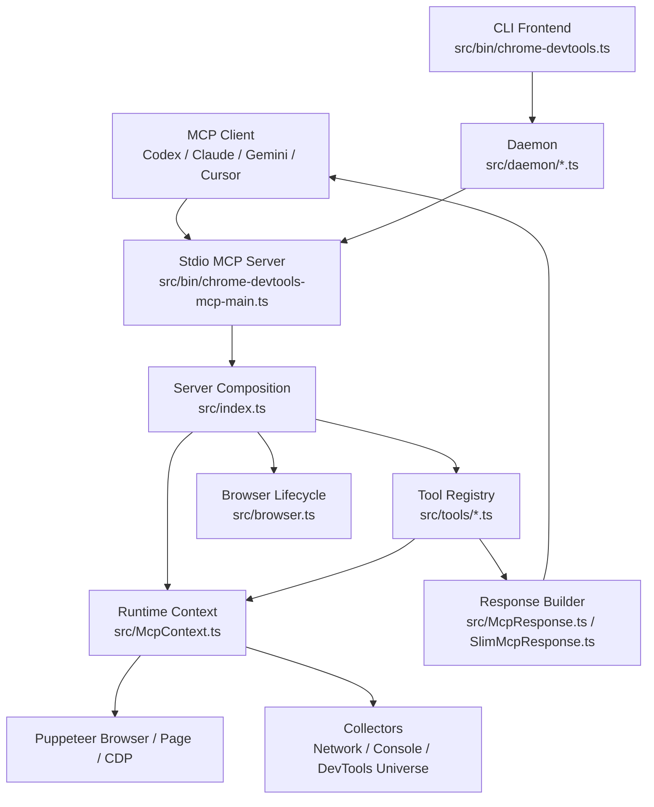
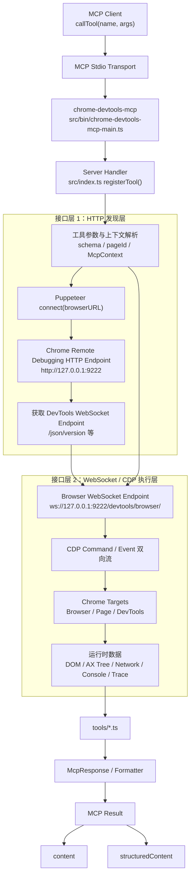
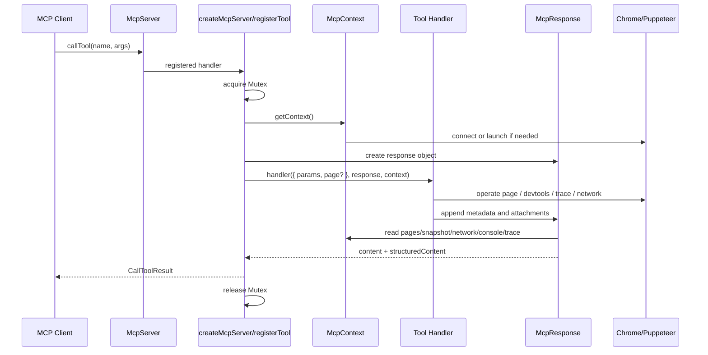

# chrome-devtools-mcp 架构调研

## 1. 文档目标

本文只聚焦 [`chrome-devtools-mcp`](https://github.com/ChromeDevTools/chrome-devtools-mcp) 本身，面向需要阅读、复用、扩展其源码的开发者，回答以下问题：

- 它解决什么问题
- 它的核心运行路径是什么
- 它的模块是如何分层的
- 一次工具调用如何从 MCP 请求走到 Chrome，再回到 MCP 响应
- 后续如果要在其上继续做增强，应该从哪些扩展点切入

调研基线：

- 上游仓库：`ChromeDevTools/chrome-devtools-mcp`
- 本次查看版本：`package.json` 中版本为 `0.20.3`
- 本次查看提交：`f7ae9e8`

## 2. 一句话结论

`chrome-devtools-mcp` 的本质是一个基于 MCP 协议暴露浏览器调试能力的适配层：

- 上游输入是 MCP client 发来的 `tool call`
- 中间层用 `Puppeteer + DevTools + 自定义上下文管理` 执行浏览器操作和调试采集
- 下游输出是适合 LLM 消费的 `text/image/structuredContent`

它并不是简单把 Puppeteer 原样暴露出去，而是做了三件更重要的事情：

1. 把浏览器能力切成较小、可组合、相对确定性的工具
2. 把原始浏览器/DevTools 数据整理成更节省 token 的摘要结果
3. 在页面、快照、网络、控制台、trace 等多个维度上维护长期上下文

## 3. 设计原则

上游在 `docs/design-principles.md` 中明确了几个关键原则，源码整体也确实围绕这些原则组织：

- Agent-agnostic：对外暴露标准 MCP，而不是绑定某个单一客户端
- Token-optimized：尽量返回语义化摘要，而不是直接吐大块原始数据
- Small, deterministic blocks：工具粒度小、职责清晰，避免“魔法大按钮”
- Self-healing errors：报错尽量带上下文和修复方向
- Human-agent collaboration：输出既要机器可消费，也要人类可读
- Progressive complexity：默认简单，必要时再暴露高级参数
- Reference over value：截图、trace 之类重资产尽量输出文件路径或引用

这组原则决定了它的代码结构不是“自动化脚本集合”，而是“受控的浏览器能力服务器”。

## 4. 总体架构

可以把它看成 5 层：

1. 启动与传输层
2. Server 装配层
3. 浏览器生命周期与运行时上下文层
4. 工具定义与执行层
5. 响应格式化与摘要层

CLI/daemon 是一条旁路，不影响 MCP Server 主架构，但复用了同一个内核。

### 4.1 数据流转图

下面这张图改为接口层视角，重点描述 `chrome-devtools-mcp` 在“连接已有 Chrome 实例”时的数据流转。

它主要分成两层：

- HTTP 层：用于发现浏览器调试入口
- WS 层：用于承载持续的 CDP 双向通信

需要注意：

- 上图聚焦 `--browserUrl` / `--wsEndpoint` 这类 connect 模式
- 如果是 `chrome-devtools-mcp` 自己拉起 Chrome，Puppeteer 也可以直接走 pipe，而不是 HTTP + WS 两段

从接口边界看，这条链可以拆成 5 段：

1. `MCP client -> stdio transport -> MCP server`
2. `MCP tool params -> server handler -> McpContext`
3. `HTTP 发现层 -> 找到 browser websocket endpoint`
4. `WS/CDP 执行层 -> 向 Chrome 发命令并接收事件`
5. `运行时原始数据 -> formatter -> MCP result`

其中最关键的是中间两层接口：

- HTTP 层负责“发现入口”，解决“连到哪”
- WS 层负责“执行调试协议”，解决“怎么持续交互”

而 `McpContext` 与 `McpResponse` 则分别负责：

- 把 WS/CDP 拿到的运行时状态组织成稳定上下文
- 把上下文状态压缩成适合 agent 消费的返回结果

## 5. 启动与传输层

### 5.1 标准 MCP 启动路径

标准入口在 `src/bin/chrome-devtools-mcp-main.ts`：

1. 引入 polyfill
2. 解析 CLI 参数
3. 可选开启日志文件
4. 根据环境变量决定是否关闭 usage statistics
5. 调用 `createMcpServer(args, { logFile })`
6. 通过 `StdioServerTransport` 与 MCP client 建立连接
7. 输出免责声明与遥测启动事件

这个入口本身很薄，职责很单一：

- 不持有浏览器逻辑
- 不理解工具语义
- 只负责把“参数 -> server -> transport”这条链打通

这符合 SRP，也让后续替换传输层或启动方式的成本较低。

### 5.2 CLI/daemon 路径

包里还有一个 `chrome-devtools` CLI，对应入口 `src/bin/chrome-devtools.ts`。它不是另一个实现，而是 MCP server 的客户端包装：

- CLI 命令被解析为工具调用
- 通过 `src/daemon/client.ts` 发给后台 daemon
- daemon 在 `src/daemon/daemon.ts` 里启动一个内嵌 MCP client
- daemon 再通过 stdio 连回 `chrome-devtools-mcp`

也就是说，CLI 架构是：

`Terminal CLI -> Daemon Socket/Pipe -> MCP Client -> MCP Server -> Browser`

这样做的收益是：

- 浏览器状态可持久化
- 后续命令可复用同一个后台实例
- CLI 不需要自己重新实现工具逻辑

代价是：

- 多了一层进程与 IPC
- CLI 故障排查比纯命令式脚本更复杂

## 6. Server 装配层

核心入口在 `src/index.ts` 的 `createMcpServer()`。

这部分是整个系统的装配中心，负责把“参数、浏览器、上下文、工具、响应、遥测”几部分接起来。

### 6.1 主要职责

`createMcpServer()` 主要做了以下几件事：

1. 根据参数初始化 `ClearcutLogger`
2. 创建 `McpServer`
3. 注册 logging 能力和初始化回调
4. 构造惰性的 `getContext()`，按需连接或启动浏览器
5. 创建全局 `Mutex`，串行化工具执行
6. 调用 `createTools(serverArgs)` 获取全部工具定义
7. 逐个执行 `registerTool()`
8. 预加载 issue descriptions

### 6.2 为什么 `getContext()` 是惰性的

浏览器连接不是在 server 启动时立即发生，而是在工具第一次执行时才解析上下文。

这样做的好处：

- MCP server 启动更快
- 没有真实工具调用时，不急着拉起 Chrome
- 可以基于实际启动参数决定连接还是新建实例

这里的上下文缓存逻辑也很关键：

- 若已有 `browser` 且连接仍有效，则复用
- 若浏览器实例变化，则重新 `McpContext.from(browser, logger, opts)`

这说明 `McpContext` 的生命周期绑定的是 `Browser` 实例，而不是 server 进程本身。

### 6.3 为什么工具执行被 `Mutex` 串行化

每个工具实际调用时，`registerTool()` 内部会先获取 `toolMutex`。

这意味着默认执行模型是串行，而不是并发。

原因很直接：

- 选中页面是全局共享状态
- 快照、控制台、网络数据都和当前 page/context 强相关
- 并发写浏览器状态容易造成竞态
- LLM 工具调用序列通常更依赖确定性而不是吞吐量

这是一个非常务实的设计取舍：优先正确性和可预测性。

## 7. 浏览器生命周期层

浏览器生命周期由 `src/browser.ts` 管理。

### 7.1 连接模式

`ensureBrowserConnected()` 支持多种连接来源：

- `browserURL`
- `wsEndpoint`
- `wsHeaders`
- `channel + userDataDir`
- `autoConnect`

其中 `autoConnect` / `userDataDir` 的关键逻辑，是通过读取 `DevToolsActivePort` 文件推导 WebSocket endpoint。

这说明它并不强依赖“自己启动浏览器”，也能接入外部已运行实例。

### 7.2 启动模式

`ensureBrowserLaunched()` 最终会调用 `launch()`，基于 Puppeteer 启动 Chrome。

关键参数包括：

- `headless`
- `executablePath`
- `channel`
- `isolated`
- `userDataDir`
- `viewport`
- `chromeArgs`
- `ignoreDefaultChromeArgs`
- `acceptInsecureCerts`
- `enableExtensions`

这里有几个重要实现点：

1. 默认会维护 profile 目录，而不是每次都临时实例
2. 若 `isolated=true`，则倾向于使用临时用户数据目录
3. `handleDevToolsAsPage: true` 让 DevTools 本身也能被当作页面处理
4. 通过 `targetFilter()` 过滤掉不希望暴露的 target，例如部分 `chrome://` 页面和扩展页

### 7.3 单例 Browser

`src/browser.ts` 顶层维护了模块级 `let browser: Browser | undefined;`

这表示在同一个 MCP server 进程内，默认只有一个 Browser 实例。

这一点影响后续扩展设计：

- 当前架构是“单 browser，多 page”
- 如果未来要引入多 browser 并发，不能只改工具层，必须调整 browser/context 的单例边界

## 8. 运行时上下文层

`src/McpContext.ts` 是上游最核心的运行时对象，也是理解整体架构的关键。

如果说 `browser.ts` 只解决“怎么拿到浏览器”，那么 `McpContext` 解决的是“如何把浏览器组织成适合 MCP 工具消费的状态模型”。

### 8.1 McpContext 管什么

`McpContext` 负责：

- 当前 Browser 引用
- Page 集合与页面快照
- `McpPage` 包装对象及 pageId
- selected page 状态
- isolated browser context 管理
- NetworkCollector
- ConsoleCollector
- DevTools Universe 管理
- extension pages / service workers
- snapshot 状态
- trace 状态
- screen recorder 状态
- emulation 状态恢复
- 文件落盘能力

它本质上是一个“浏览器会话聚合根”。

### 8.2 Page 模型

上游没有直接把 Puppeteer `Page` 暴露给工具，而是再包了一层 `McpPage`。

这样做的意义：

- 给 page 分配稳定的 `pageId`
- 绑定 text snapshot 与 uid 映射
- 管理 dialog、selected element、emulation state
- 支撑从 LLM 视角更稳定的页面定位

`McpContext.createPagesSnapshot()` 会：

1. 发现所有 page
2. 为新页面分配 `McpPage`
3. 回收已消失页面
4. 维护 selected page
5. 同步 DevTools 窗口状态

这也是 page 列表、page 选择、pageId 路由能工作的基础。

### 8.3 Selected page 是全局焦点

很多工具默认作用于 selected page，而不是每次都显式传 page。

优点：

- 工具调用更简洁
- 更符合交互式调试流程

代价：

- 引入全局隐式状态
- 对并发不友好

因此上游后来又加入了实验性的 `experimentalPageIdRouting`，给 page-scoped tool 增加 `pageId` 形参，这是对全局 selected page 模式的重要补强。

### 8.4 Isolated contexts

`newPage(background, isolatedContextName)` 支持把新页面放进具名 isolated browser context。

同名 context 复用，不同名 context 隔离 cookies/storage。

这对于多任务、多身份、多会话场景非常关键，也是后续做更强“路由/隔离”能力的重要基础。

### 8.5 数据采集器

`McpContext` 在初始化时会构建三个关键采集组件：

- `NetworkCollector`
- `ConsoleCollector`
- `UniverseManager`

它们分别提供：

- 网络请求列表和稳定 ID
- 控制台、异常、issue 采集与稳定 ID
- DevTools universe 级别的数据桥接

这使得工具不必自己订阅底层事件，而是依赖统一上下文查询。

### 8.6 快照机制

`createTextSnapshot()` 基于 accessibility tree 构造文本快照，并给节点分配 MCP 可引用的 uid。

这是整个工具体系里非常关键的一层抽象，因为：

- LLM 不适合直接操作 DOM 节点句柄
- accessibility tree 相比原始 DOM 更稳定、更适合语义化定位
- uid 机制为 click/fill/hover 等工具建立了统一定位协议

这也是上游区别于“纯 Puppeteer 脚本接口”的核心价值之一。

## 9. 工具定义与注册层

### 9.1 工具注册总线

`src/tools/tools.ts` 是工具装配入口。

它会从多个分类模块中收集工具：

- `console`
- `emulation`
- `extensions`
- `inPage`
- `input`
- `lighthouse`
- `memory`
- `network`
- `pages`
- `performance`
- `screencast`
- `screenshot`
- `script`
- `snapshot`

若传了 `--slim`，则切换成精简工具集 `src/tools/slim/tools.ts`。

最后按 `name` 排序，交由 `src/index.ts` 统一注册。

### 9.2 工具抽象

`src/tools/ToolDefinition.ts` 定义了统一抽象：

- `ToolDefinition`
- `defineTool()`
- `definePageTool()`
- `Context`
- `Response`

这里有两个很重要的架构点。

第一个是把“工具能访问什么”收缩成 `Context` 接口，而不是直接把整个 `McpContext` 暴露给所有工具。

这能控制耦合范围，也降低工具间互相污染实现细节的风险。

第二个是把“工具怎么返回结果”抽象成 `Response` 接口，而不是要求每个工具自己拼 MCP 原始 payload。

这让工具 handler 更像“声明我要附带哪些信息”，而不是自己处理输出格式。

### 9.3 Page-scoped tool

`definePageTool()` 会把工具标记为 `pageScoped: true`。

这类工具在注册时可以自动拼接 `pageIdSchema`，从而支持按特定页面执行，而不依赖当前 selected page。

这是当前架构中最值得关注的可扩展点之一，因为它直接关系到多页面可控性。

### 9.4 按分类开关暴露工具

`registerTool()` 会基于启动参数过滤工具类别：

- `categoryEmulation`
- `categoryPerformance`
- `categoryNetwork`
- `categoryExtensions`
- `categoryInPageTools`
- `experimentalVision`
- `experimentalInteropTools`
- `experimentalScreencast`

这说明工具清单不是硬编码常量，而是“参数驱动的能力裁剪”。

## 10. 响应格式化层

`src/McpResponse.ts` 与 `src/SlimMcpResponse.ts` 负责把工具执行结果转换为 MCP 响应。

### 10.1 为什么要有 Response Builder

工具执行不直接返回最终结果，而是通过 `Response` 接口声明：

- 是否附带页面列表
- 是否附带 snapshot
- 是否附带网络请求
- 是否附带控制台消息
- 是否附带 trace/lighthouse
- 是否附带 image

最后由 `response.handle(toolName, context)` 统一生成：

- `content`
- `structuredContent`

这层设计的收益很大：

- 工具逻辑和展示逻辑解耦
- 文本输出和结构化输出可以并行维护
- 可以集中做分页、格式化、文件落盘、摘要裁剪

### 10.2 双通道输出

`McpResponse` 最终同时支持两种消费方式：

1. `content`
适合大多数 MCP client 直接展示给模型

2. `structuredContent`
适合 CLI、自动化系统或更稳定的程序消费

这是一个非常务实的设计：

- LLM 需要自然语言摘要
- 工具链又需要稳定 JSON 结构

二者并存，避免只做一边。

### 10.3 Formatter 体系

复杂数据不会直接内嵌在工具实现里拼接，而是交给 formatter：

- `SnapshotFormatter`
- `NetworkFormatter`
- `ConsoleFormatter`
- `IssueFormatter`

这保持了职责清晰：

- 工具只负责“拿什么数据”
- formatter 负责“怎么描述这些数据”

## 11. 一次工具调用的完整链路

以下是一次标准工具调用的真实主链路。

### 11.1 调用流程

1. MCP client 发起 `callTool`
2. `McpServer.registerTool()` 注册过的 handler 被触发
3. 先获取 `toolMutex`，确保串行
4. `getContext()` 解析当前 Browser / McpContext
5. 调用 `context.detectOpenDevToolsWindows()`
6. 创建 `McpResponse` 或 `SlimMcpResponse`
7. 若为 page-scoped tool，解析目标 page
8. 执行工具 handler
9. handler 通过 `response.*` 记录需要返回的内容
10. `response.handle()` 汇总并格式化结果
11. 返回 MCP `content`，必要时附带 `structuredContent`
12. 记录 telemetry
13. 释放互斥锁

### 11.2 流程图

## 12. Tool 分类与能力边界

根据 `docs/tool-reference.md`，当前工具大致分为：

- Input automation
- Navigation automation
- Emulation
- Performance
- Network
- Debugging

从源码视角看，这些工具背后可以进一步分成三类：

### 12.1 状态修改型

例如：

- `click`
- `fill`
- `navigate_page`
- `select_page`
- `emulate`

特点：

- 会改变浏览器状态
- 对 selected page 和等待策略敏感

### 12.2 数据读取型

例如：

- `list_pages`
- `list_network_requests`
- `list_console_messages`
- `take_snapshot`

特点：

- 主要依赖上下文缓存和 formatter
- 更强调稳定 ID、分页和摘要

### 12.3 重型分析型

例如：

- `performance_start_trace`
- `performance_stop_trace`
- `performance_analyze_insight`
- `lighthouse_audit`
- `take_memory_snapshot`

特点：

- 运行时间较长
- 需要文件输出或 trace 结果缓存
- 对性能和错误恢复要求更高

## 13. 错误处理与确定性设计

上游虽然功能多，但总体还是偏保守设计。

### 13.1 确定性来源

它主要靠以下策略提升可预测性：

- 工具串行执行
- selected page 单焦点模型
- pageId 作为实验性补充
- uid 基于 snapshot，而不是直接暴露瞬态 DOM handle
- 大部分复杂输出经过 formatter 统一规范化

### 13.2 错误处理方式

工具执行错误会在 `registerTool()` 中统一捕获，并返回：

- `content: [{ type: "text", text: errorText }]`
- `isError: true`

同时还会拼接 `cause` 信息。

这不算特别复杂，但足够实用，符合“Self-Healing Errors”的最低要求。

## 14. 遥测与非功能模块

上游还维护了几块非功能性模块：

- `src/telemetry/*`
- `src/logger.ts`
- `src/version.ts`
- `src/issue-descriptions.ts`
- `src/trace-processing/*`

其中比较关键的是：

### 14.1 telemetry

默认开启 usage statistics，可通过参数或环境变量关闭。

记录内容包括：

- tool invocation success
- latency bucket
- server start
- client name

这不是业务主路径，但它解释了为什么 `createMcpServer()` 里混有遥测逻辑。

### 14.2 trace-processing

性能相关工具不是简单把 trace 文件原样返回，而是会做 parse 和 insight 提取。

这意味着它并不只是“录 trace 的外壳”，而是把 Chrome DevTools 和 Lighthouse 的性能理解能力进一步摘要化，变成更适合 LLM 消费的结果。

## 15. 上游架构的优点

从源码实现看，这套架构有几个明显优点。

### 15.1 分层清晰

入口、上下文、工具、响应、格式化基本分开，主职责边界明确。

### 15.2 高复用

MCP Server 与 CLI 共享同一个工具内核，没有出现两套浏览器控制逻辑并行维护的问题。

### 15.3 对 LLM 友好

它不是直接暴露底层对象，而是做了：

- 稳定 ID
- token 优化摘要
- 结构化输出
- 分页
- 重资产文件引用

### 15.4 扩展路径明确

后续如果要新增能力，通常只需要沿固定路径扩展：

- 新增工具
- 扩展 Context
- 增加 formatter
- 必要时增加 collector

## 16. 上游架构的限制

这部分对后续继续使用或改造非常关键。

### 16.1 单 Browser 单焦点

当前天然偏向：

- 单 Browser
- 单 selected page
- 串行工具执行

这对交互式调试非常合适，但对复杂多页面编排并不天然友好。

### 16.2 全局状态较重

`McpContext` 能力很强，但也承担了很多职责：

- page 管理
- collector 管理
- trace 管理
- file save
- extension 管理
- emulation 恢复

它是系统核心，同时也是后续最容易继续膨胀的点。

### 16.3 工具层依赖上下文语义

虽然用了 `Context` 接口隔离，但工具仍然默认站在“当前 page/当前会话”语义上。

如果未来想切成更严格的无状态执行模型，改造成本不低。

### 16.4 并发能力受限

互斥锁让系统更稳定，但也天然限制吞吐量。

对于 agent 场景，这是合理的；对于高频并行自动化场景，则是潜在瓶颈。

## 17. 最值得关注的扩展点

如果后续要在 `chrome-devtools-mcp` 基础上继续演进，最值得关注的切入点有 4 个。

### 17.1 pageId 路由

这是从“隐式 selected page”走向“显式目标 page”的关键一步。

### 17.2 isolated context

这是从“单会话浏览器”走向“多会话隔离”的关键一步。

### 17.3 Response/Formatter

这是继续做 token 优化、结构化输出增强、富结果引用的最佳切点。

### 17.4 Collector/Universe

这是继续增强 DevTools 深度调试能力的基础设施层。

## 18. 适合如何理解这套代码

阅读上游源码时，建议按下面顺序理解，而不是直接从某个工具文件开始钻细节：

1. `src/bin/chrome-devtools-mcp-main.ts`
2. `src/index.ts`
3. `src/browser.ts`
4. `src/McpContext.ts`
5. `src/tools/ToolDefinition.ts`
6. `src/tools/tools.ts`
7. `src/McpResponse.ts`
8. 某一个具体工具模块，例如 `src/tools/pages.ts` 或 `src/tools/network.ts`
9. 对应 formatter 和测试

这样更容易先建立整体心智模型，再进入局部实现。

## 19. 总结

`chrome-devtools-mcp` 不是“把 Puppeteer 套一层 MCP”这么简单。

它的真正价值在于：

- 用 MCP 标准暴露浏览器调试能力
- 用 `McpContext` 把浏览器运行时状态组织成可被工具稳定消费的上下文
- 用小粒度工具 + formatter + structuredContent，把复杂浏览器数据转成更适合 agent 的结果

从工程实现上看，它最核心的骨架可以概括为：

- `browser.ts` 负责拿到 Browser
- `McpContext.ts` 负责组织 Browser 运行时
- `tools/*.ts` 负责定义能力边界
- `McpResponse.ts` 负责把能力结果整理成 MCP 可消费输出
- `index.ts` 负责把以上所有部分装配成真正可运行的 MCP Server

如果后续要基于它继续做更复杂的浏览器编排或路由能力，`pageId`、`isolated context`、`Response/Formatter`、`Context` 边界将是最重要的几个扩展抓手。
